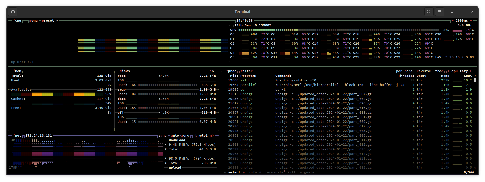

# Upstream Identifiers

Goal: Extract all identifiers from major upstream bibliographic datasets and
calculate overlap. Especially, assess how much is missing from the current
fatcat catalog (based on a recent postgres dump).

* [x] oai (300M)
* [x] fatcat (200M)
* [x] openalex (250M, 150M DOI)
* [x] crossref (160M)
* [x] datacite (47M)
* [x] pubmed (35M)
* [x] RG (20M)
* [x] doaj (25M)
* [x] dblp (3M)
* [ ] OL (4M)
* [ ] issn (2M)
* [ ] ror (0.1M)

## Summary

Main datasets ("8D"): "oaiscrape", fatcat, openalex, crossref, datacite, pubmed, doaj, dblp

The DOI union of these datasets consists of: 223085045 DOI. There may be around 275000000 DOI given out in total as of 02/2024.

Table shows (7) columns: "dataset 1", "dataset 2", "size of 1", "size of 2", "overlap between 1 and 2", "1 only", "2 only"

```shell
$ cat result.tsv | column -t
fatcat     crossref   183_017_029  153_842_785  134_042_379  48_974_650   19_800_406
fatcat     datacite   183_017_029  53_335_897   40_322_809   142_694_220  13_013_088
fatcat     dblp       183_017_029  5_898_952    5_416_373    177_600_656  482_579
fatcat     doaj       183_017_029  8_073_056    6_957_139    176_059_890  1_110_538
fatcat     oaiscrape  183_017_029  26_917_651   21_124_085   161_892_944  5_793_566
fatcat     openalex   183_017_029  154_390_913  136_692_169  46_324_860   17_698_744
fatcat     pubmed     183_017_029  29_059_848   27_730_123   155_286_906  1_329_719
crossref   datacite   153_842_785  53_335_897   89_895       153_752_890  53_246_002
crossref   dblp       153_842_785  5_898_952    5_597_997    148_244_788  300_955
crossref   doaj       153_842_785  8_073_056    7_537_060    146_305_725  530_617
crossref   oaiscrape  153_842_785  26_917_651   19_454_526   134_388_259  7_463_125
crossref   openalex   153_842_785  154_390_913  146_044_108  7_798_677    8_346_805
crossref   pubmed     153_842_785  29_059_848   28_590_950   125_251_835  468_892
datacite   dblp       53_335_897   5_898_952    225_137      53_110_760   5_673_815
datacite   doaj       53_335_897   8_073_056    125_722      53_210_175   7_941_955
datacite   oaiscrape  53_335_897   26_917_651   3_071_013    50_264_884   23_846_638
datacite   openalex   53_335_897   154_390_913  3_333_986    50_001_911   151_056_927
datacite   pubmed     53_335_897   29_059_848   10_995       53_324_902   29_048_847
dblp       doaj       5_898_952    8_073_056    344_904      5_554_048    7_722_773
dblp       oaiscrape  5_898_952    26_917_651   1_211_927    4_687_025    25_705_724
dblp       openalex   5_898_952    154_390_913  5_805_104    93_848       148_585_809
dblp       pubmed     5_898_952    29_059_848   413_802      5_485_150    28_646_040
doaj       oaiscrape  8_073_056    26_917_651   5_088_632    2_979_045    21_829_019
doaj       openalex   8_073_056    154_390_913  7_901_602    166_075      146_489_311
doaj       pubmed     8_073_056    29_059_848   3_445_970    4_621_707    25_613_872
oaiscrape  openalex   26_917_651   154_390_913  20_514_042   6_403_609    133_876_871
oaiscrape  pubmed     26_917_651   29_059_848   6_490_899    20_426_752   22_568_943
openalex   pubmed     154_390_913  29_059_848   28_854_453   125_536_460  205_389
```

## Crossref

Extracting 153M rows and 3 columns from crossref takes 38min.

```shell
$ time zstdcat -T0 crossref-2024-01-01.ndj.zst | \
    parallel --pipe -j 16 --block 20M "jq -rc '[.DOI, .member, .title[0]?] | @tsv'" | \
    pv -l | \
    zstd -c -T0 > crossref-2024-01-01-ids.tsv.zst

real    38m50.866s
user    347m51.814s
sys     53m37.135s
```

Iterating over the TSV (6.5G compressed) takes 25s. Creating sorted DOI:

```
$ time zstdcat -T0 crossref-2024-01-01-ids.tsv.zst | LC_ALL=C sort -S 70% -u | zstd -c -T0 > crossref-2024-01-01-doi-sorted.tsv.zst
```

Need to normalize to lowercase DOI, just in case.

```
$ time zstdcat -T0 crossref-2024-01-01-doi-sorted.tsv.zst | \
    parallel --pipe --block 20M -j 24 tr '[:upper:]' '[:lower:]' | \
    pv -l | \
    LC_ALL=C sort -u -S70% | \
    zstd -c -T0 > crossref-2024-01-01-doi-sorted-lower.tsv.zst

real    0m17.892s
user    0m36.366s
sys     0m22.811s
```

Number of crossref DOI: 153842785 (did not change after lowercasing).

> DOI: 153842785

## DOAJ

Extracting and sorting DOI from DOAJ (19GB compressed, 79GB uncompressed).

```shell
$ time zstdcat -T0 doaj-oaipmh-2024-01-01.xml.zst | \
    pv | \
    grep -o -E '<dc:identifier>.*</dc:identifier>' | \
    sed -e  's@</dc:identifier>@\n@g;s@<dc:identifier>@@g' | \
    grep '^10[.]' | \
    LC_ALL=C sort -S 70% -u | \
    zstd -c > doaj-oaipmh-2024-01-01-doi.tsv.zst

real    11m14.755s
user    13m5.051s
sys     0m39.432s
```

Unique DOI in DOAJ: 8073056 (did not change after lowercasing).

> DOI: 8073056

## DataCite

> DOI: 53335897

## Pubmed

Single file pubmed version, takes less than 4 hours to assemble from about a
thousand (remote) files, results in a 75G compressed XML (654GiB uncompressed);
about 8min to just cat.

```shell
$ curl -sL "https://ftp.ncbi.nlm.nih.gov/pubmed/baseline/" | \
    pup 'a[href] text{}' \
    grep -o 'pubmed.*[.]xml[.]gz' | \
    awk '{print "https://ftp.ncbi.nlm.nih.gov/pubmed/baseline/"$0}' | \
    urlstream -v | \
    zstd -T0 -c > pubmed-$(date +"%Y-%m-%d").xml.zst

real    205m9.144s
user    90m57.286s
sys     20m36.800s
```

Create DOI:

```
$ zstdcat -T0 pubmed-2024-02-09.xml.zst| \
    grep '<ArticleId IdType="doi">' | \
    sed -e 's@<ArticleId IdType="doi">@@;s@</ArticleId>@@;s@^ *@@' | \
    pv -l | \
    LC_ALL=C sort -S 60% -u | \
    zstd -c -T0 > pubmed-2024-02-09-doi.tsv.zst

real    9m4.635s
user    10m32.147s
sys     3m31.833s
```

Some cleanup and normalization:

```
$ time zstdcat -T0 pubmed-2024-02-09-doi.tsv.zst | \
    LC_ALL=C grep '^10[.]' | \
    tr '[:upper:]' '[:lower:]' | \
    LC_ALL=C sort -u -S70% | \
    zstd -c -T0 > pubmed-2024-02-09-doi-lower.tsv.zst
```

> Number of unique DOI: 29059848

## OpenAlex

```
$ cd data/works
$ find . -type f -name "*.gz" | wc -l
512
```

Create a single file version.

```shell
$ time find . -type f -name "*.gz" | \
    parallel --block 10M --line-buffer -j 24 -I {} unpigz -c {} | \
    pv -l | \
    zstd -c -T0 > /var/data/share/openalex.ndj.zst
```



Extract ids and title.

```
$ time zstdcat -T0 openalex-works-2024-02-09.ndj.zst | \
    parallel --pipe --block 50M -j 24 "jq -rc '[.id, .doi, .doi_registration_agency, .title] | @tsv'" | \
    pv -l | \
    zstd -c -T0 > openalex-works-2024-02-09-ids.tsv.zst

real    73m44.383s
user    785m42.501s
sys     119m14.222s
```

Iterating over a 248M row 4 column TSV takes 46s. Create a sorted list of DOI.

```
$ time zstdcat -T0 openalex-works-2024-02-09-ids.tsv.zst | \
    pv -l | \
    cut -f 2 | \
    LC_ALL=C sort -S 70% -u | \
    zstd -c -T0 > openalex-works-2024-02-09-doi-sorted.tsv.zst

real    1m36.328s
user    3m39.460s
sys     0m43.192s
```

How many DOI in openalex?

```
$ time zstdcat -T0 openalex-works-2024-02-09-doi-sorted.tsv.zst | pv -l | wc -l
154390916

real    0m4.339s
user    0m5.587s
sys     0m3.104s
```

These DOI are URL, reduce to "DOI" only:

```
$ time zstdcat -T0 openalex-works-2024-02-09-doi-sorted.tsv.zst | \
    pv -l | \
    sed -e 's@https://doi.org/@@g' | \
    LC_ALL=C sort -S 70% | \
    zstd -c -T0 > openalex-works-2024-02-09-doi-sorted-small.tsv.zst

real    1m0.451s
user    1m22.895s
sys     0m15.677s

$ mv openalex-works-2024-02-09-doi-sorted-small.tsv.zst \
    openalex-works-2024-02-09-doi-sorted.tsv.zst
```

After lowercasing we lose 3 DOI:

```
$ time zstdcat -T0 openalex-works-2024-02-09-doi-sorted.tsv.zst | \
    tr '[:upper:]' '[:lower:]' | \
    LC_ALL=C sort -u -S70% | \
    zstd -c -T0 > openalex-works-2024-02-09-doi-sorted-lower.tsv.zst
```

Number of DOI in openalex: 154390913.

> DOI: 154390913

## oaiscrape

From: [https://archive.org/details/oai_harvest_2023-11-01](https://archive.org/details/oai_harvest_2023-11-01)

* 326M docs, 433GB uncompressed

```
$ zstdcat -T0 2023-11-01-metha-oai.ndjson.zst| pv -l | wc -lc
326M 0:06:09 [ 882k/s] [                                                                                                                              <=>                                                                                    ]
326163077 465924072501
```

Trying to get a list of DOI out of that dataset:

```
$ time zstdcat -T0 2023-11-01-metha-oai.ndjson.zst | \
    LC_ALL=C parallel --pipe -j 24 --block 50M "grep -Eo '10[.][0-9]*/[^\")\r\n]*'" | \
    tr '[:upper:]' '[:lower:]' | \
    pv -l | \
    LC_ALL=C sort -S70% -u | \
    zstd -c -T0 > 2023-11-01-metha-oai-doi.ndjson.zst

real    8m57.189s
user    14m46.231s
sys     13m30.512s
```

About: 26917651 DOI (data has issues).

> DOI: 26917651

## DBLP

From: [https://archive.org/details/dblp-2024-02-01](https://archive.org/details/dblp-2024-02-01)

```
$ time zstdcat -T0 dblp-2024-02-01.xml.zst | \
    grep -Eo '10[.][0-9]*/[^\"<]*' | \
    tr '[:upper:]' '[:lower:]' | \
    LC_ALL=C sort -u -S70% | \
    zstd -c -T0 > dblp-2024-02-01-doi.tsv.zst
```

> DOI: 5898952

## Fatcat

Use last public dump from 06/2023.

```
$ time zstdcat -T0 release_extid.tsv.zst | \
    cut -f3  | \
    grep -v ^$ | \
    sed -e 's@^[ ]*@@g' | \
    tr '[:upper:]' '[:lower:]' | \
    LC_ALL=C sort -S60% -u | \
    zstd -c -T0 > release_doi.tsv.zst

real    1m21.518s
user    3m33.142s
sys     0m26.442s
```

> DOI: 183017029

## Count

```
$ python dataset_pairs.py  | column -t | sort -k2,2 -n
dblp       5898952
doaj       8073056
oaiscrape  26917651
pubmed     29059848
datacite   53335897
crossref   153842785
openalex   154390913
fatcat     183017029
```

## Overlaps

Calculate overlaps over pairs:

```
$ python dataset_pairs.py  | column -t
fatcat     crossref
fatcat     datacite
fatcat     dblp
fatcat     doaj
fatcat     oaiscrape
fatcat     openalex
fatcat     pubmed
crossref   datacite
crossref   dblp
crossref   doaj
crossref   oaiscrape
crossref   openalex
crossref   pubmed
datacite   dblp
datacite   doaj
datacite   oaiscrape
datacite   openalex
datacite   pubmed
dblp       doaj
dblp       oaiscrape
dblp       openalex
dblp       pubmed
doaj       oaiscrape
doaj       openalex
doaj       pubmed
oaiscrape  openalex
oaiscrape  pubmed
openalex   pubmed
```

For 28 comparisons, we ran 5 queries each (140 queries), duckdb needed about
40G of RAM and about 3 minutes.

```shell
$ cat result.tsv | column -t
fatcat     crossref   183_017_029  153_842_785  134_042_379  48_974_650   19_800_406
fatcat     datacite   183_017_029  53_335_897   40_322_809   142_694_220  13_013_088
fatcat     dblp       183_017_029  5_898_952    5_416_373    177_600_656  482_579
fatcat     doaj       183_017_029  8_073_056    6_957_139    176_059_890  1_110_538
fatcat     oaiscrape  183_017_029  26_917_651   21_124_085   161_892_944  5_793_566
fatcat     openalex   183_017_029  154_390_913  136_692_169  46_324_860   17_698_744
fatcat     pubmed     183_017_029  29_059_848   27_730_123   155_286_906  1_329_719
crossref   datacite   153_842_785  53_335_897   89_895       153_752_890  53_246_002
crossref   dblp       153_842_785  5_898_952    5_597_997    148_244_788  300_955
crossref   doaj       153_842_785  8_073_056    7_537_060    146_305_725  530_617
crossref   oaiscrape  153_842_785  26_917_651   19_454_526   134_388_259  7_463_125
crossref   openalex   153_842_785  154_390_913  146_044_108  7_798_677    8_346_805
crossref   pubmed     153_842_785  29_059_848   28_590_950   125_251_835  468_892
datacite   dblp       53_335_897   5_898_952    225_137      53_110_760   5_673_815
datacite   doaj       53_335_897   8_073_056    125_722      53_210_175   7_941_955
datacite   oaiscrape  53_335_897   26_917_651   3_071_013    50_264_884   23_846_638
datacite   openalex   53_335_897   154_390_913  3_333_986    50_001_911   151_056_927
datacite   pubmed     53_335_897   29_059_848   10_995       53_324_902   29_048_847
dblp       doaj       5_898_952    8_073_056    344_904      5_554_048    7_722_773
dblp       oaiscrape  5_898_952    26_917_651   1_211_927    4_687_025    25_705_724
dblp       openalex   5_898_952    154_390_913  5_805_104    93_848       148_585_809
dblp       pubmed     5_898_952    29_059_848   413_802      5_485_150    28_646_040
doaj       oaiscrape  8_073_056    26_917_651   5_088_632    2_979_045    21_829_019
doaj       openalex   8_073_056    154_390_913  7_901_602    166_075      146_489_311
doaj       pubmed     8_073_056    29_059_848   3_445_970    4_621_707    25_613_872
oaiscrape  openalex   26_917_651   154_390_913  20_514_042   6_403_609    133_876_871
oaiscrape  pubmed     26_917_651   29_059_848   6_490_899    20_426_752   22_568_943
openalex   pubmed     154_390_913  29_059_848   28_854_453   125_536_460  205_389
```

Total number of unique DOI found: 223085045

> Approximately 275 million DOI names assigned to date -- [doi.org](https://www.doi.org/the-identifier/resources/factsheets/key-facts-on-digital-object-identifier-system)

## fatcat misses

How many DOI do we not have in fatcat and what prefixes are they?

```sql
D (select doi from crossref except select doi from fatcat) union
    (select doi from datacite except select doi from fatcat) union
    (select doi from openalex except select doi from fatcat) union
    (select doi from doaj except select doi from fatcat) union
    (select doi from dblp except select doi from fatcat) union
    (select doi from pubmed except select doi from fatcat) union
    (select doi from oaiscrape except select doi from fatcat);
```

This query requires about 107GB of RAM and takes 25.58s and results in 40068016
rows. Fatcat misses 40068016 DOI that exist in upstream sources.

Exporting TSV:

```sql
COPY ((select doi from crossref except select doi from fatcat)
    union (select doi from datacite except select doi from fatcat)
    union (select doi from openalex except select doi from fatcat)
    union (select doi from doaj except select doi from fatcat)
    union (select doi from dblp except select doi from fatcat)
    union (select doi from oaiscrape except select doi from fatcat)
    union (select doi from pubmed except select doi from fatcat))
    TO 'fatcat_doi_miss.tsv' (DELIMITER '\t');
```

