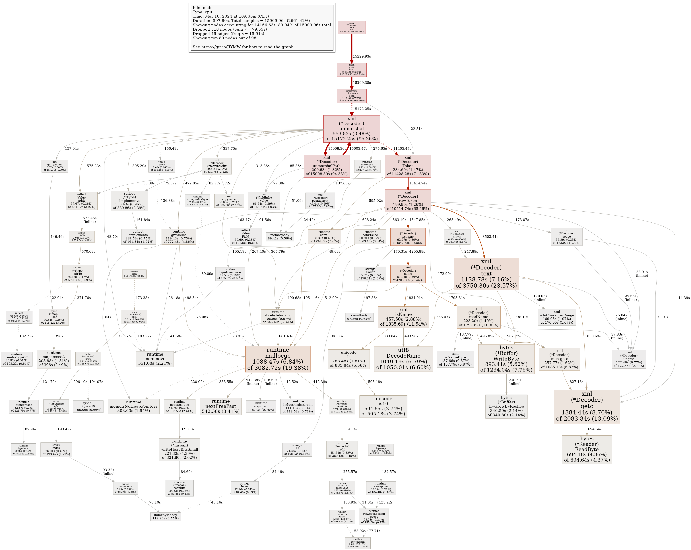

# Stub releases

We stub-converted six upstream sources into fatcat release entities. The
slowest was pubmed, which is XML, which is harder to paralellize. Just minimal
fields, ids and title. Combined, 36GB compressed, so about 150GB uncompressed.
859,412,127 records. And we still miss arxiv, dblp, ...

```shell
$ time zstdcat -T0 /var/data/share/pubmed/pubmed-2024-02-09.xml.zst |
    ./skconv -f pubmed |
    pv -l |
    zstd -c -T0 > data/pubmed.ndj.zst

48.5M 3:56:13 [3.42k/s] [

real    236m13.372s
user    251m13.389s
sys     9m30.703s
```

So, about 4h for 48.5M records. All JSON inputs run fast, e.g. openalex 45min,
crossref 23min, etc.

## Testing parallel XML processing

Trying a variant of
[parallel](https://github.com/miku/parallel/blob/master/examples/xmlstream/main.go)
to process XML in parallel. Batch size is 100, 32 workers. Memory usage hovers
at 32GB, which is insane. We look at only 3200 x sizeof(single XML doc) + 3200
x sizeof(single JSON doc) + some scratch space of data, not that much.

First results look promising, about 48.5M XML elements parsed and turned into
(a simple) JSON in a about 20min.

Pubmed.

```sh
$ curl -sL "https://ftp.ncbi.nlm.nih.gov/pubmed/baseline/" | \
    pup 'a[href] text{}' | \
    grep -o 'pubmed.*[.]xml[.]gz' | \
    awk '{print "https://ftp.ncbi.nlm.nih.gov/pubmed/baseline/"$0}' | \
    sort -u > links.txt

$ time cat links.txt | \
    urlstream -v | \
    zstd -T0 -c > pubmed-2024-03-18.xml.zst

real    161m9.951s
user    52m19.303s
sys     12m48.341s
```

Resulting XML is just concatenated, and invalid as a whole. About 38GB
compressed, 327GB uncompressed. Zstdcat'ing takes about 3 min, at about
2GB/s.

Running the above
[example](https://github.com/miku/parallel/blob/master/examples/xmlstream/main.go),
we get stable 50-60% CPU usage, but only bursty output, according to pv, like
something between 0 and 200k lines/s. Next step is to try to use sync.Pool to
reduce buffer allocations and to reduce memory usage.


```
$ time zstdcat -T0 /var/data/share/pubmed/pubmed-2024-03-18.xml.zst | \
    ./main | \
    pv -l | \
    zstd -c -T0 > out.json.zst

36.2M 0:12:23 [48.7k/s]

real    12m23.501s
user    213m29.837s
sys     5m37.366s
```

About 36M docs.

```
$ time zstdcat -T0 pubmed-2024-03-18.xml.zst | \
    LC_ALL=C grep -Fc '<PubmedArticle>'

36557510

real    3m30.048s
user    5m37.438s
sys     2m11.368s
```

After some `sync.Pool` tweaks, we are down to less than 10 min.

```sh
$ time zstdcat -T0 /var/data/share/pubmed/pubmed-2024-03-18.xml.zst | \
    ./main -cpuprofile cpu.pprof | \
    pv -l | \
    zstd -c -T0 > out-pprof.json.zst

36.2M 0:09:59 [60.4k/s]

real    9m59.663s
user    268m18.805s
sys     5m24.783s
```

It seems, that most time is spent in XML and there is little left to optimize
(except for memory usage).



There were a few bugs in the record splitting code, which should be fixed now.
We need to do a bit more slice growing, so performance dropped a bit (21
instead of 10 min). An optimization would be to look into ringbuffers or the
like to reduce allocations.

## Note on daily update

An example daily update slice from pubmed: 73MB compressed gzip, takes a few seconds to process:

```
$ time unpigz -c pubmed24n1328.xml.gz | skconv -f pubmed -x 98304 | wc -l
30000

real    0m2.837s
user    0m21.956s
sys     0m0.605s
```
## First stub conversion results

```
$ tree -sh data/
[4.0K]  data/
├── [ 85M]  arxiv.ndj.zst
├── [6.7G]  crossref.ndj.zst
├── [978M]  datacite.ndj.zst
├── [121M]  dblp.ndj.zst
├── [2.2G]  doaj.ndj.zst
├── [ 36G]  fatcat.ndj.zst
├── [ 10G]  oaiscrape.ndj.zst
├── [ 14G]  openalex.ndj.zst
├── [1.3G]  pubmed.ndj.zst
└── [  50]  README.md

0 directories, 10 files
```

We have 853M records, about 160GB (plain iteration takes about 2min).

```
$ zstdcat -T0 fatcat.ndj.zst | pv -l | wc -lc
853390984 161224784989
```

After a few mapped fields, the combined data file is 62GB, compressed, it takes
5:12 min to iterate though the file. Uncompressed size at 340GiB.

```
$ zstdcat -T0 data/fatcat.ndj.zst | pv -l | wc -l
853390984
```

A rough comparison of normalized titles:

```
$ time zstdcat -T0 data/fatcat.ndj.zst | \
    parallel -j 32 --pipe --block 10M 'jq .title | strnorm' | \
    pv -l | \
    LC_ALL=C sort -T /var/data/tmp -S 70% | \
    zstd -c -T0 > /var/data/tmp/fatcat-titles-norm.txt.zst

real    18m8.948s
user    223m23.395s
sys     38m8.054s
```

Buffers for sort, 90GB; 18min to extract and sort 800M+ docs. Running `uniq`
takes about 1:54min. About 400M unique titles.

```
$ zstdcat -T0 /var/data/tmp/fatcat-titles-norm-count.txt.zst | pv -l | wc -l
405632047
```

## Combined catalog

Combined catalog:

```
$ cat \
    arxiv.ndj.zst \
    crossref.ndj.zst \
    datacite.ndj.zst \
    dblp.ndj.zst \
    doaj.ndj.zst \
    oaiscrape.ndj.zst \
    openalex.ndj.zst \
    pubmed.ndj.zst > fatcat.ndj.zst
```

Result: 81GB compressed, 418GiB uncompressed, 845,950,447 lines. Takes about
5min to iterate over.

After a few more iterations, we are at 101GB compressed, 845,950,447 lines,
564597949331 bytes (525GB).
